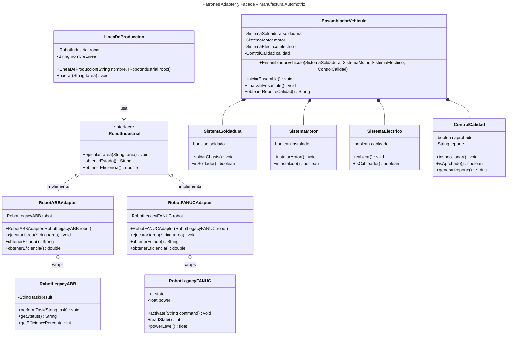

# Proyecto - Java Adapter y Facade en Manufactura Automotriz


## Requisitos del Ejercicio

Diseña e implementa los patrones de diseño **Adapter** y **Facade** en el dominio de la **manufactura automotriz**.

### Patrón Adaptador (Adapter objetual)

Una línea de producción moderna gestiona robots industriales a través de una interfaz unificada (`IRobotIndustrial`). Sin embargo, la planta cuenta con dos robots legacies incompatibles:

- **Robot ABB** (`RobotLegacyABB`): expone `performTask(String)`, `getStatus(): String` y `getEfficiencyPercent(): int`.
- **Robot FANUC** (`RobotLegacyFANUC`): expone `activate(String)`, `readState(): int` (0=inactivo, 1=operativo, 2=error) y `powerLevel(): float`.

Debes crear un Adapter por composición para cada robot, de modo que `LineaDeProduccion` (Client) pueda operar con ambos sin ningún cambio en su código.

| Rol del patrón | Clase |
|---|---|
| Target | `IRobotIndustrial` |
| Adaptee 1 | `RobotLegacyABB` |
| Adaptee 2 | `RobotLegacyFANUC` |
| Adapter 1 | `RobotABBAdapter` |
| Adapter 2 | `RobotFANUCAdapter` |
| Client | `LineaDeProduccion` |

### Patrón Fachada (Facade)

El proceso de ensamblado de un vehículo involucra cuatro subsistemas complejos: soldadura del chasis, instalación del motor, cableado eléctrico e inspección de calidad. Crea `EnsambladorVehiculo` como Facade que oculte esta complejidad y exponga únicamente:

- `iniciarEnsamble()` – activa soldadura, motor y eléctrico.
- `finalizarEnsamble()` – ejecuta la inspección de calidad.
- `obtenerReporteCalidad()` – retorna el reporte de la inspección.

Los subsistemas se inyectan por constructor para permitir pruebas unitarias aisladas.

## Diagrama de clases
[Editor en línea](https://mermaid.live/)

[Referencia-Mermaid](https://mermaid.js.org/syntax/classDiagram.html)

## Diagrama de clases UML con draw.io

El repositorio está configurado para crear Diagramas de clases UML con ```draw.io```. Sigue estos pasos para usarlo:

1. Haz doble clic sobre el archivo ```uml.class.drawio.png``` en el explorador de archivos.
2. Se abrirá el editor de ```draw.io``` integrado en el entorno.
3. En la barra lateral izquierda, haz clic en ```+Más formas```.
4. En el cuadro de diálogo, busca y activa la categoría **UML** y haz clic en ```Aceptar```.
5. Las formas UML estarán disponibles en el panel izquierdo para arrastrarlas al lienzo.
6. Diseña tu diagrama de clases UML agregando clases, atributos, métodos y relaciones.
7. Guarda los cambios con ```Ctrl+S``` (o ```Cmd+S``` en Mac). El archivo ```.png``` se actualizará automáticamente.

### Prompts para generar los Diagramas de Clase y Secuencia con MermAId

Para mejores resultados sigue estos pasos:

1. Abre el chat de GitHub Copilot en tu entorno de desarrollo.
2. Agrega como contexto las clases del proyecto (por ejemplo, arrastra los archivos `.java` al chat o menciónalos con `#`).
3. Aplica el prompt para el **Diagrama de Clases UML**:

```
@mermaid /uml
```

4. Revisa el diagrama generado en la vista previa de Mermaid.
5. Si también necesitas un **Diagrama de Secuencia**, aplica el siguiente prompt (manteniendo el mismo contexto):

```
@mermaid /sequence
```

6. Copia el código Mermaid generado y pégalo en la sección correspondiente del ```README.md``` o en [el editor en línea](https://mermaid.live/) para visualizarlo.

## Ejemplo de ejecución en consola

```
=== SISTEMA DE MANUFACTURA AUTOMOTRIZ ===

--- PATRON ADAPTADOR: Robot ABB ---
[LineaDeProduccion] Linea: Ensamble Norte | Tarea: Soldadura de chasis
[RobotABBAdapter] Traduciendo solicitud al sistema legacy ABB...
[RobotLegacyABB] performTask ejecutado: Soldadura de chasis
[LineaDeProduccion] Estado: OPERATIVO | Eficiencia: 0.87

--- PATRON ADAPTADOR: Robot FANUC ---
[LineaDeProduccion] Linea: Ensamble Sur | Tarea: Pintado de carroceria
[RobotFANUCAdapter] Traduciendo solicitud al sistema legacy FANUC...
[RobotLegacyFANUC] activate ejecutado: Pintado de carroceria
[LineaDeProduccion] Estado: OPERATIVO | Eficiencia: 0.92

--- PATRON FACHADA ---
[EnsambladorVehiculo] Iniciando ensamble...
  [SistemaSoldadura] Chasis soldado correctamente
  [SistemaMotor] Motor V6 instalado
  [SistemaElectrico] Cableado electrico completado
[EnsambladorVehiculo] Finalizando ensamble...
  [ControlCalidad] Inspeccionando vehiculo...
  [ControlCalidad] Aprobado: todos los sistemas OK
[EnsambladorVehiculo] Reporte: Vehiculo VIN-2026-0307 aprobado - todos los sistemas OK
```

## Versión de Java

Verifica que tengas la versión adecuada de Java para trabajar con Maven. En caso de requerir una versión especial, usa los siguientes comandos.

### Verificar versión actual
```
java --version
```
### Verificar versiones disponibles para instalar
```
sdk list java
```
### Instalar la última versión
```
sdk install java
```
### Instalar una versión específica
```
sdk install java xxx-version
```
Ejemplo:
```
sdk install java 17.0.18-ms
```
## Uso del proyecto con Maven

### Compilar
```
mvn compile
```
### Probar N tests
```
mvn test
```

### Pruebas individuales del ejercicio
```
mvn test -Dtest="RobotABBAdapterTest#debeEjecutarTareaLegacyViaAdapter"
mvn test -Dtest="RobotABBAdapterTest#debeTraducirEstadoDelRobot"
mvn test -Dtest="RobotABBAdapterTest#debeConvertirEficienciaASistemaModerno"
mvn test -Dtest="RobotABBAdapterTest#debePermitirLineaProduccionUsarRobotLegacy"
mvn test -Dtest="RobotFANUCAdapterTest#debeAdaptarRobotFANUCEnLineaDeProduccion"
mvn test -Dtest="EnsambladorVehiculoTest#debeActivarSoldaduraDuranteEnsamble"
mvn test -Dtest="EnsambladorVehiculoTest#debeInstalarMotorDuranteEnsamble"
mvn test -Dtest="EnsambladorVehiculoTest#debeCablearSistemaElectricoDuranteEnsamble"
mvn test -Dtest="EnsambladorVehiculoTest#debeGenerarReporteDeCalidadAlFinalizar"
```
### Ejecutar App
```
mvn -q exec:java
```
```
java -cp target/classes miPrincipal.App
```
### Empacar App
```
mvn package
```
### Limpiar binarios
```
mvn clean
```
## Comandos Git-Cambios y envío a Autograding

### Por cada cambio importante que haga, actualice su historia usando los comandos:
```
git add .
git commit -m "Descripción del cambio"
```
### Envíe sus actualizaciones a GitHub para Autograding con el comando:
```
git push origin main
```
